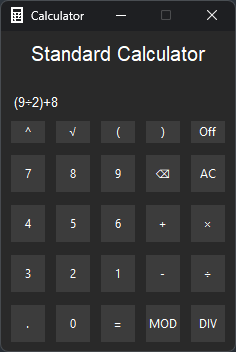

# Tkinter Calculator
A simple non-scientific calculator programmed in python using the tkinter graphics library.

## Functionality
- Compact Intuitive Interface
- Keyboard Support
- MOD & DIV Support
- Syntax Error Detection

## Credits
<a href="https://github.com/Techeryy">Programmed By Stephen Adams - Techeryy</a>

<a href="https://www.flaticon.com/free-icons/iphone">Application Favicon By Freepik - Flaticon</a>
