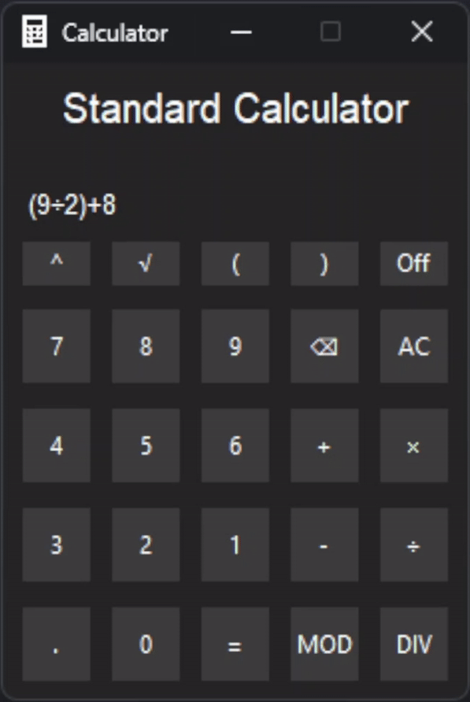

# Tkinter Calculator
A non-scientific calculator programmed in python using the tkinter graphics library. The dark themed user interface provides support for a variety of mathmatical operations, including +, -, ×, ÷, ^, √, MOD & DIV. Additionally the calculator provides full keyboard support, allowing users to navigate and edit their mathematical expressions using the arrow keys.

## Functionality
- Compact Intuitive Interface [Dark Mode]
- Keyboard Support
- Exponent & Square Root
- MOD & DIV Support
- Input Sanitisation
- Syntax Error Detection
- Dedicated Power Off Button
- Blinking Cursor & Navigation

## Requirements
- **Python 3.0** ↳ Python Packages: re, os, math, time, threading, ctypes, tkinter & functools
- **Windows 11** - Required For Dark Title Bar [Optional]

## Credits
<a href="https://github.com/Techeryy">Programmed By Stephen Adams - Techeryy</a>

<a href="https://www.flaticon.com/free-icons/calculator">Application Favicon By Freepik - Flaticon</a>
